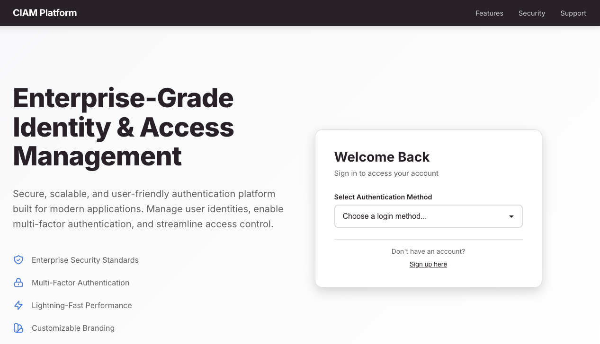

# Auth0 CIAM Demo

A comprehensive Customer Identity and Access Management (CIAM) demo application showcasing Auth0's key features.

## Screenshots

### Homepage



*Screenshot of the application homepage showing the login interface with organization-specific branding*

## Features

- **Flexible Login Options**: Dropdown menu to select from database and passwordless connections
- **Organization-Specific Branding**: Dynamic branding based on subdomain (e.g., `org.localhost`)
- **Account Linking**: Link/unlink social media accounts (Google, Facebook, X/Twitter)
- **Self-Service MFA Enrollment**: Users can enroll in SMS, Email, or TOTP (Authenticator App) MFA factors
- **Profile Management**: User profile page with account information and settings

## Prerequisites

- Node.js 18+ and npm/yarn
- An Auth0 tenant
- Auth0 Application configured
- Auth0 Management API credentials

## Setup

1. **Clone and install dependencies**:
   ```bash
   npm install
   ```

2. **Configure environment variables**:
   Copy `.env.local.example` to `.env.local` and fill in your Auth0 credentials:
   ```bash
   cp .env.local.example .env.local
   ```

   Required environment variables:
   - `AUTH0_SECRET`: Generate using `openssl rand -hex 32`
   - `AUTH0_BASE_URL`: Your application URL (e.g., `http://localhost:3000`)
   - `AUTH0_ISSUER_BASE_URL`: Your Auth0 domain (e.g., `https://YOUR_TENANT.auth0.com`)
   - `AUTH0_CLIENT_ID`: Your Auth0 Application Client ID
   - `AUTH0_CLIENT_SECRET`: Your Auth0 Application Client Secret
   - `AUTH0_DOMAIN`: Your Auth0 domain (e.g., `YOUR_TENANT.auth0.com`)
   - `AUTH0_MANAGEMENT_API_CLIENT_ID`: Management API Client ID
   - `AUTH0_MANAGEMENT_API_CLIENT_SECRET`: Management API Client Secret

3. **Configure connections**:
   Edit `connections.json` to include your Auth0 connection IDs:
   ```json
   [
     {
       "id": "con_database_username_password",
       "displayName": "Username/Password"
     },
     {
       "id": "con_passwordless_email",
       "displayName": "Email (Passwordless)"
     },
     {
       "id": "con_passwordless_sms",
       "displayName": "SMS (Passwordless)"
     }
   ]
   ```

4. **Configure Auth0 Application**:
   - In Auth0 Dashboard, go to Applications → Your Application
   - Set **Allowed Callback URLs**: 
     ```
     http://localhost:3000/api/auth/callback,http://localhost:3000/api/auth/link-callback
     ```
   - Set **Allowed Logout URLs**: `http://localhost:3000`
   - Set **Allowed Web Origins**: `http://localhost:3000`

5. **Set up Management API**:
   - In Auth0 Dashboard, go to Applications → APIs → Auth0 Management API
   - Create a Machine to Machine application
   - Authorize it and grant the following scopes:
     - `read:users`
     - `update:users`
     - `read:authentication_methods` (required for viewing enrolled MFA factors)
     - `read:organizations`
     - `read:organization_members`
     - `read:connections`
   - Use the Client ID and Client Secret in your `.env.local`

6. **Configure Social Connections** (optional):
   - In Auth0 Dashboard, go to Authentication → Social
   - Enable Google, Facebook, and Twitter/X connections
   - Configure each with appropriate credentials

7. **Set up Organizations** (optional):
   - In Auth0 Dashboard, go to Organizations
   - Create organizations as needed
   - Configure branding for each organization

## Running the Application

```bash
npm run dev
```

The application will be available at `http://localhost:3000`.

## Testing Organization-Specific Branding

To test organization-specific branding:

1. Create an organization in your Auth0 tenant (e.g., "org")
2. Configure branding for that organization
3. Access the application at `http://org.localhost:3000`
   - Note: You may need to add `127.0.0.1 org.localhost` to your `/etc/hosts` file (Mac/Linux) or `C:\Windows\System32\drivers\etc\hosts` (Windows)

## Project Structure

```
auth0-ciam-demo/
├── app/
│   ├── api/
│   │   ├── auth/[...auth0]/     # Auth0 authentication routes
│   │   ├── organizations/       # Organization API routes
│   │   └── user/                 # User management API routes
│   ├── profile/                 # Profile page
│   ├── layout.tsx               # Root layout
│   ├── page.tsx                 # Home/login page
│   └── globals.css              # Global styles
├── components/
│   ├── LoginPage.tsx            # Login component with connection dropdown
│   ├── AccountLinking.tsx      # Account linking component
│   └── MFAEnrollment.tsx        # MFA enrollment component
├── connections.json             # Connection configuration
├── package.json
├── tsconfig.json
└── next.config.js
```

## Key Features Implementation

### Login with Connection Dropdown
- Users can select from available database and passwordless connections
- Connection selection is passed to Auth0 during login

### Organization Detection
- Client-side parsing of hostname to detect organization subdomain
- Fetches organization branding from Auth0 Management API
- Applies organization-specific branding to login page

### Account Linking
- Uses Auth0 Management API to link/unlink social accounts
- Supports Google, Facebook, and X/Twitter
- Displays linked account status on profile page

### MFA Enrollment
- Self-service enrollment for TOTP, SMS, Email, and Auth0 Guardian (push notifications)
- Uses Auth0's native MFA features and Management API
- TOTP: Generates QR code for authenticator apps via Auth0
- SMS/Email: Sends verification codes via Auth0
- Push notifications: Auth0 Guardian integration
- Enrollment status is managed by Auth0's authentication methods API

## Notes

- This is a demo application and should not be used in production without proper security hardening
- MFA enrollment uses Auth0's native authentication methods API (`/api/v2/users/{id}/authentication-methods`) for secure MFA management
- Account linking uses Auth0's standard OAuth flow
- Organization branding requires proper organization setup in Auth0
- Email verification is required before users can enable MFA factors

## Resources

- [Auth0 Documentation](https://auth0.com/docs)
- [Auth0 Management API](https://auth0.com/docs/api/management/v2)
- [Auth0 Authentication API](https://auth0.com/docs/api/authentication)
- [Next.js Documentation](https://nextjs.org/docs)

